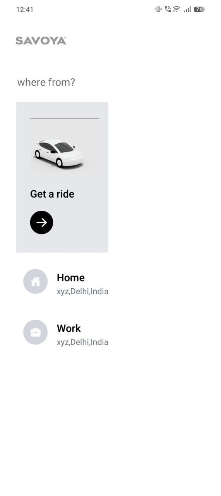

Here’s an updated version of the `README.md` file tailored for a GitHub repository, with space for three images to showcase how the app looks:

---

# Taxi Booking App 🚖

This is a **React Native-based taxi booking application** that allows users to select a pickup location, choose a destination, and select a ride option. The app integrates with **Google Places API** for location search and uses **Redux** for state management. It’s designed to provide a smooth and intuitive user experience for booking rides.

---

## Features ✨

- **Home Screen**: Users can enter their pickup location using Google Places Autocomplete.
- **Map Screen**: Displays the map with the selected origin and destination markers.
- **Ride Options**: Users can choose from different ride options (e.g., Lux, Lux SUV, Ultra Lux).
- **Navigation**: Smooth navigation between screens using **React Navigation**.
- **Redux State Management**: Manages the state for origin, destination, and ride options.

---

## Screenshots 📸

Here are some screenshots of the app in action:

| **Home Screen** | **Map Screen** | **Ride Options** |
|-----------------|----------------|------------------|
|  |  |  |


---

## Tech Stack 🛠️

- **Frontend**: React Native
- **State Management**: Redux Toolkit
- **Navigation**: React Navigation
- **Maps**: React Native Maps
- **Styling**: Tailwind CSS (via `tailwind-react-native-classnames`)
- **API Integration**: Google Places Autocomplete

---

## Getting Started 🚀

### Prerequisites

- Node.js and npm installed on your machine.
- Expo CLI installed globally (`npm install -g expo-cli`).
- A **Google Places API key** (required for location search).

### Installation

1. **Clone the repository**:
   ```bash
   git clone https://github.com/your-username/taxi-booking-app.git
   cd taxi-booking-app
   ```

2. **Install dependencies**:
   ```bash
   npm install
   ```

3. **Set up environment variables**:
   - Create a `.env` file in the root directory.
   - Add your Google Places API key:
     ```env
     API=your_google_places_api_key
     ```

4. **Run the application**:
   - Start the Expo development server:
     ```bash
     npm start
     ```
   - Use the **Expo Go** app on your mobile device to scan the QR code and run the app.

### Running on Different Platforms

- **Android**:
  ```bash
  npm run android
  ```
- **iOS**:
  ```bash
  npm run ios
  ```
- **Web**:
  ```bash
  npm run web
  ```

---

## Project Structure 📂

```
taxi-booking-app/
├── App.js                # Main application entry point
├── index.js              # Registers the root component
├── store.js              # Redux store configuration
├── Screens/              # Contains all the screens
│   ├── HomeScreen.js     # Home screen with location input
│   ├── MapScreen.js      # Map screen with origin and destination markers
├── components/           # Reusable components
│   ├── NavOptions.js     # Navigation options component
│   ├── NavFavourites.js  # Favorite locations component
│   ├── Map.js            # Map component
│   ├── NavigateCard.js   # Destination input component
│   ├── RideOptionsCard.js # Ride options component
├── slices/               # Redux slices for state management
│   ├── navSlice.js       # Slice for navigation state
├── assets/               # Static assets like images
├── package.json          # Project dependencies and scripts
```

---

## Dependencies 📦

The project uses the following major dependencies:

- **React Navigation**: For handling navigation between screens.
- **Redux Toolkit**: For state management.
- **Google Places Autocomplete**: For location search.
- **React Native Maps**: For displaying the map and markers.
- **Tailwind CSS**: For styling components.
- **React Native Elements**: For UI components like icons and buttons.

For a full list of dependencies, refer to the [`package.json`](package.json) file.

---

## Contributing 🤝

If you'd like to contribute to this project, please follow these steps:

1. Fork the repository.
2. Create a new branch for your feature or bugfix.
3. Commit your changes and push to the branch.
4. Submit a pull request.

---

## License 📄

This project is licensed under the **0BSD License**. See the [`LICENSE`](LICENSE) file for more details.

---

## Showcase 🎥

*(You can add a short video or GIF here to demonstrate the app in action if you have one.)*

---

Feel free to customize this `README.md` further to suit your needs! You can replace the placeholder image links with actual screenshots of your app once you have them. Let me know if you need further assistance! 😊
